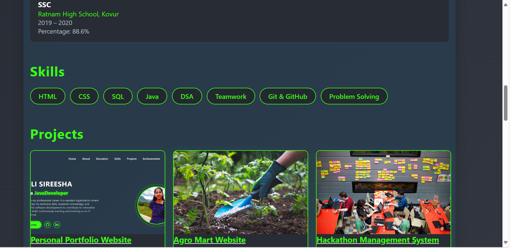

# 🌾 AgroMart - Empowering Farmers Through Technology

AgroMart is a modern web platform built to support farmers by offering a centralized hub for purchasing agricultural inputs such as fertilizers and seeds. It enhances accessibility, provides product information, and helps in smart and sustainable farming practices.

 
 
 
 
 
 
 
 
---

## 🧭 Table of Contents
- [Features](#-features)
- [Live Demo](#-live-demo)
- [Technologies Used](#-technologies-used)
- [How to Run Locally](#-how-to-run-locally)
- [Folder Structure](#-folder-structure)
- [Future Enhancements](#-future-enhancements)
- [Screenshots](#-screenshots)
- [Author](#-author)
- [License](#-license)

---

## ✨ Features

- 🔐 **Secure Login System**: Ensures user data protection.
- 🛍️ **Product Catalog**: Organic & chemical fertilizers, seeds, and micronutrients.
- 🛒 **Shopping Cart**: Add/remove items and see total price instantly.
- 📚 **Learn More Links**: Directs to detailed agricultural articles.
- 🏷️ **Price Display**: Transparent product pricing for comparison.
- 🌐 **Multi-Page Navigation**: Seamless transition between Home, Products, About, Contact, and Cart.
- 📞 **Contact Form**: Farmers can reach out for support or inquiries.
- 🧩 **Modular Design**: Easy to expand with additional features.

## 🧑‍💻 Technologies Used

| Technology | Purpose |
|------------|---------|
| HTML5      | Structure of the webpage |
| CSS3       | Styling and responsive design |
| JavaScript | Functionality like login, cart logic, dynamic display |

agromart/
│
├── index.html       # Main HTML page
├── style.css        # Internal styles in HTML (can be separated)
├── /assets          # Images: fertilizers, seeds, icons (add if external)
├── README.md        # Project documentation
🚀 Future Enhancements
✅ User Authentication with Backend (Node.js + MongoDB)

✅ Payment Integration

✅ Multi-language Support

✅ Mobile App Version

✅ Real-time Chat with Agri Experts

✅ Farmer Dashboard for Order Tracking and Suggestions

✅ Weather-based Smart Recommendations

❤️ Acknowledgements
💚 Thanks to the agriculture community for inspiration

📚 Resources from AgriFarming.in

🛠️ Open-source developer guides and communities

